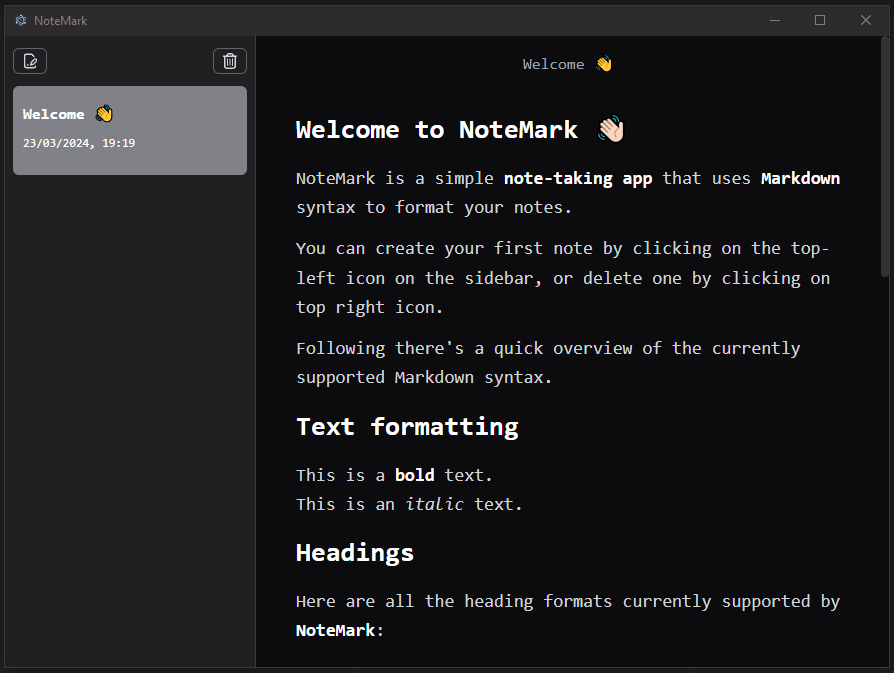

# NoteMark

Um aplicação electron com React e Typescript

## Configurações recomendadas para IDE

- [VSCode](https://code.visualstudio.com/) + [ESLint](https://marketplace.visualstudio.com/items?itemName=dbaeumer.vscode-eslint) + [Prettier](https://marketplace.visualstudio.com/items?itemName=esbenp.prettier-vscode)

## Configuração do projeto

### Instalar

```bash
$ yarn
```

### Desenvolver

```bash
$ yarn dev
```

### Buildar

```bash
# For windows
$ yarn build:win

# For macOS
$ yarn build:mac

# For Linux
$ yarn build:linux
```

### Imagens do APP

- Tela de Boas Vindas
  

> Créditos: Code With Gionatha
